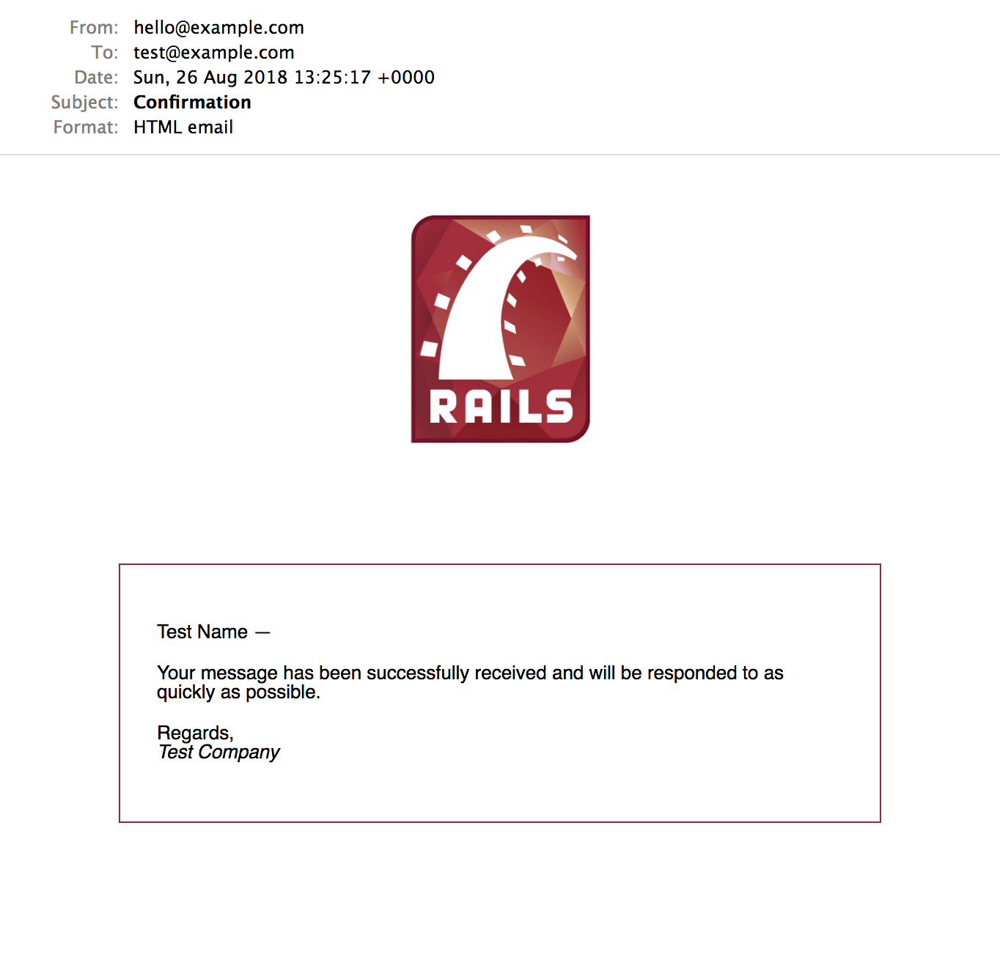

# Rails-MJML test

Email should look like this (using 4.1.0):



Launch Rails server:

```
rails s
```

Visit email preview:

[http://0.0.0.0:3000/rails/mailers/test_mailer/confirmation](http://0.0.0.0:3000/rails/mailers/test_mailer/confirmation)
